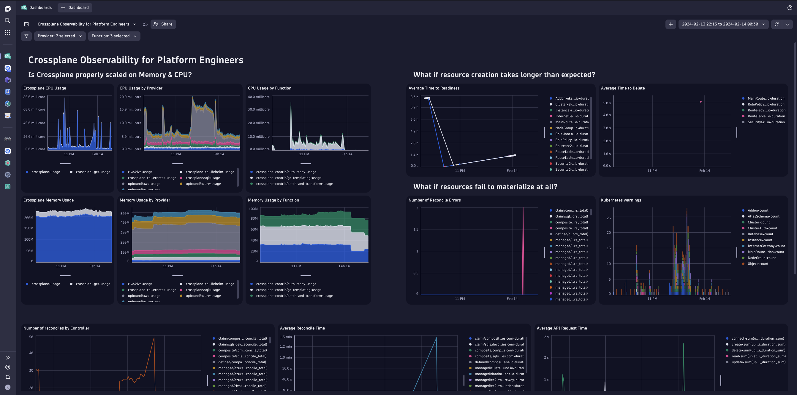
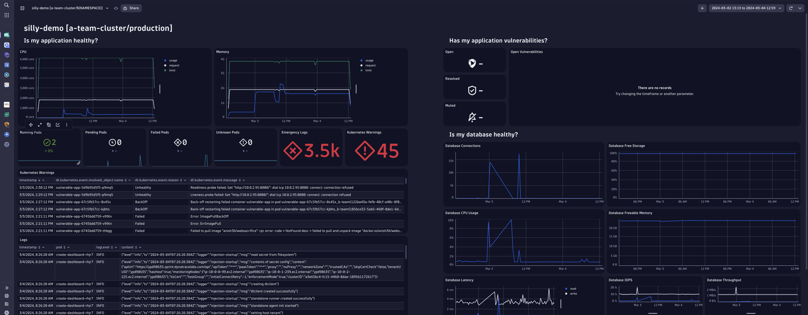

# Crossplane Observability Demo Dashboards

This repository contains a Helm chart to create Dynatrace dashboards for
the [crossplane-observability-demo](https://github.com/vfarcic/crossplane-observability-demo).
See [values.yaml](./values.yaml) for all possible values and information about them.

Currently, it supports two dashboards. Soon, a cluster dashboard will be added as well.

## Crossplane Metrics

A dashboard that visualizes some of the metrics Crossplane and its providers expose to ensure all resources are
deployed & reconciled correctly.

## App

A dashboard that shows information about a certain application.

